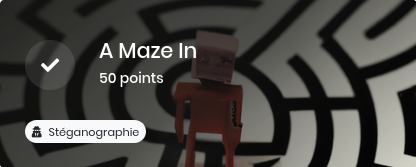
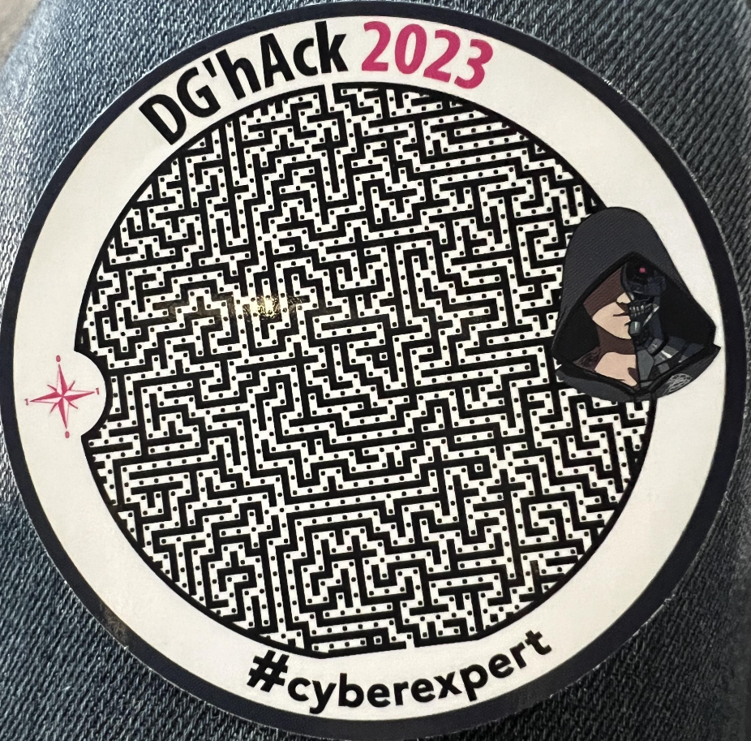
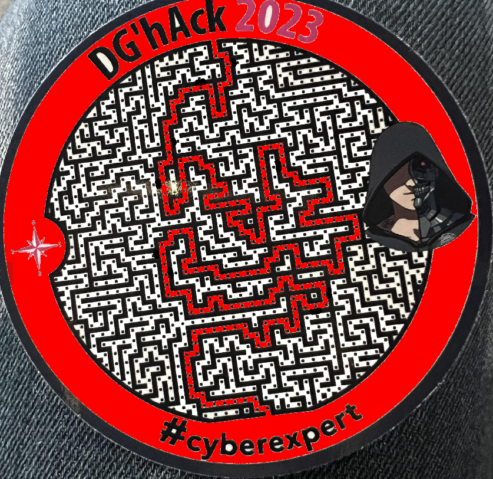

# A Maze In

## Introduction

Le traditionnel goodie de la DGHACK !

## Description

Rendez-vous au stand DGA lors de l’European Cyber Week 2023 qui se tiendra à Rennes du 21 au 23 novembre 2023, un challenge se cache dans un des goodies qui vous seront offerts.

Saurez-vous le retrouver et le résoudre ?

-----

## Résolution

Un labyrinthe, quand on se déplace d'un point vers le bas ou le haut, c'est un 0, vers la gauche ou a droit, c'est un 1.

En trouvant la sortie, on formait une suite de bits, plus qu'à convertir en UTF-8 !

Merci à mon collègue @Kilian et sa maîtrise de GIMP pour trouver le chemin efficacement !

    01000100
    01000111
    01001000
    01000001
    01000011
    01001011
    01111011
    01010100
    01101000
    00110001
    01110011
    01011111
    00110001
    01110011
    01011111
    01110100
    01101000
    00110011
    01011111
    01010111
    00110100
    01011001
    01011111
    00100001
    01111101

https://gchq.github.io/CyberChef/#recipe=From_Binary('Space',8)&input=MDEwMDAxMDAKMDEwMDAxMTEKMDEwMDEwMDAKMDEwMDAwMDEKMDEwMDAwMTEKMDEwMDEwMTEKMDExMTEwMTEKMDEwMTAxMDAKMDExMDEwMDAKMDAxMTAwMDEKMDExMTAwMTEKMDEwMTExMTEKMDAxMTAwMDEKMDExMTAwMTEKMDEwMTExMTEKMDExMTAxMDAKMDExMDEwMDAKMDAxMTAwMTEKMDEwMTExMTEKMDEwMTAxMTEKMDAxMTAxMDAKMDEwMTEwMDEKMDEwMTExMTEKMDAxMDAwMDEKMDExMTExMDE

Et voilà celui qu'on attendait DGHACK{Th1s_1s_th3_W4Y_!} !