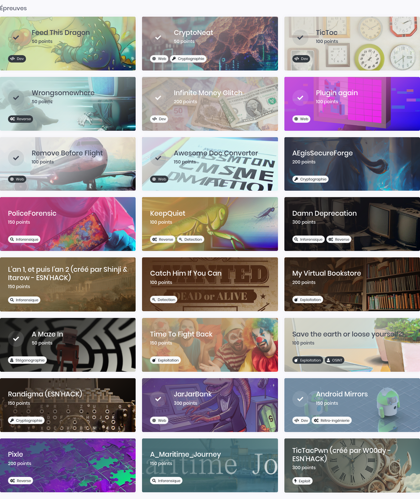
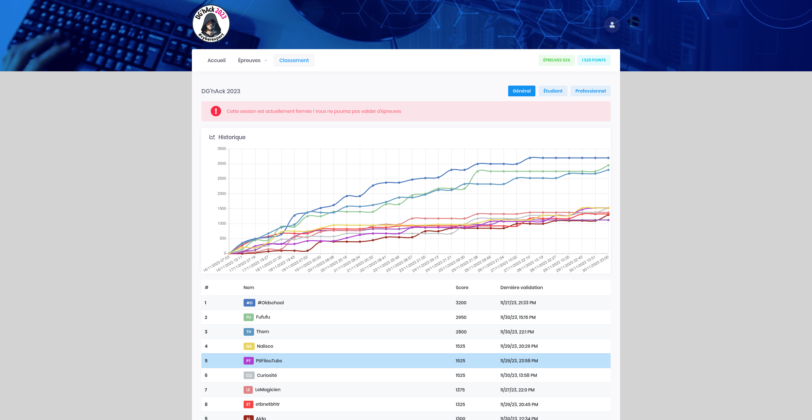

# DGHACK 2023

[DG'hAck 2023] (https://www.dghack.fr/)

Deuxième édition DGHACK CTF à laquelle je participais (rang : 5/1522), et quelques nouveaux write-ups !

J'ai apprécié une nouveauté cette année: les challenges multi-flags, qui permettaient de résoudre en partie certains challenges et d'aiguiller quelles pistes il fallait privilégier.

Bravo à tous les participants et un grand Merci aux organisteurs et aux builders pour ces challenges de qualité et réaliste.

- [JarJarBank](./JarJarBank/README.md) - Web - 300 pts
- [InfiniteMoneyGlitch](./InfiniteMoneyGlitch/README.md) - Dev - 200 pts
- [AMazeIn](./AMazeIn/README.md) - Stéganographie - 50 pts

## Les épreuves

## Scoreboard

